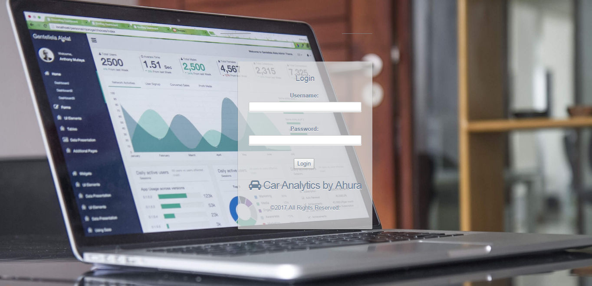
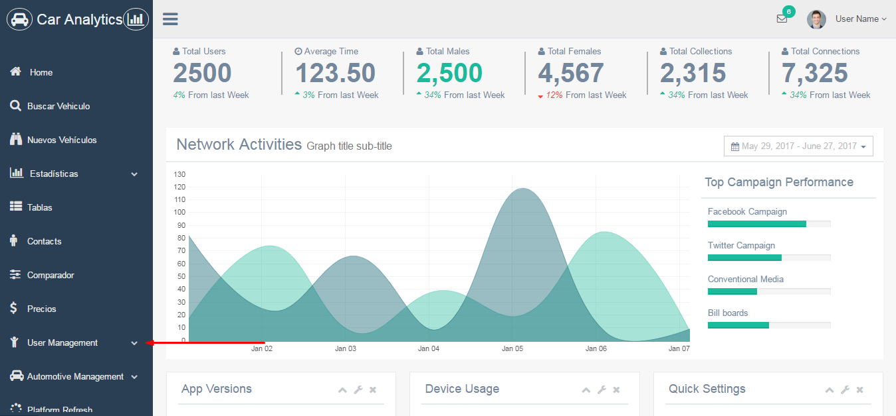
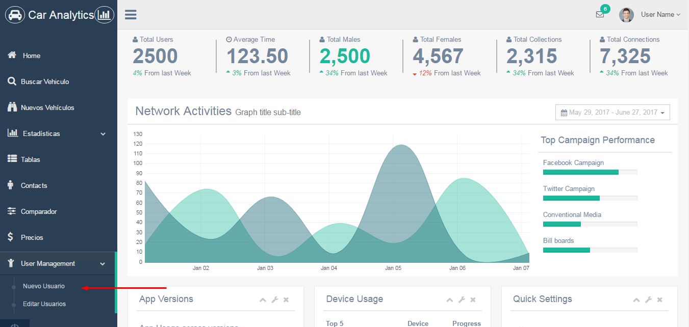
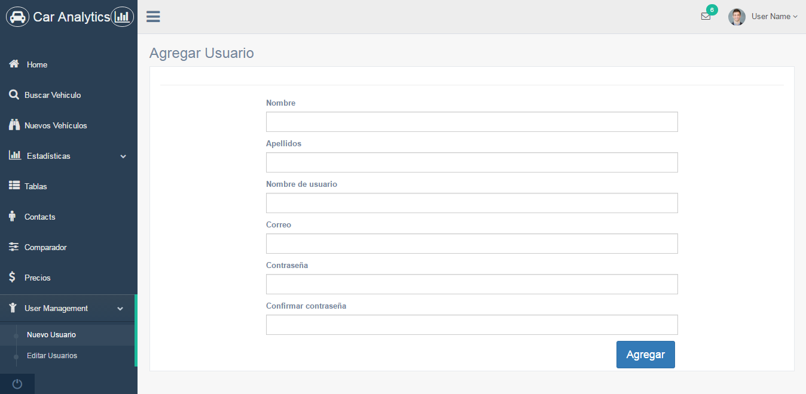
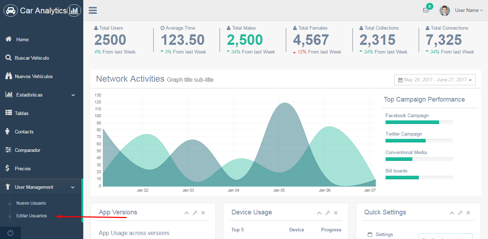
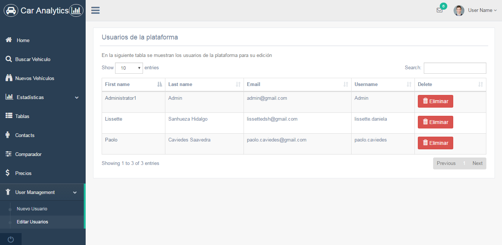
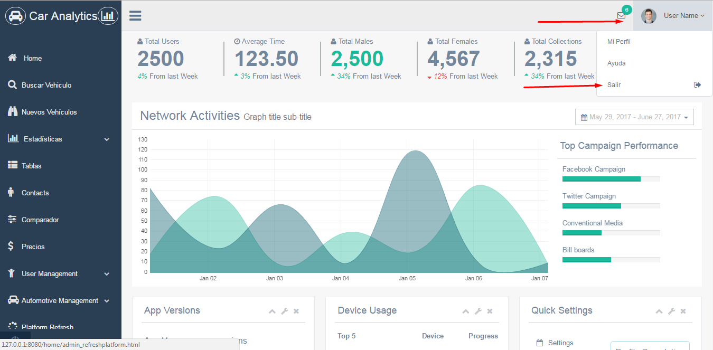
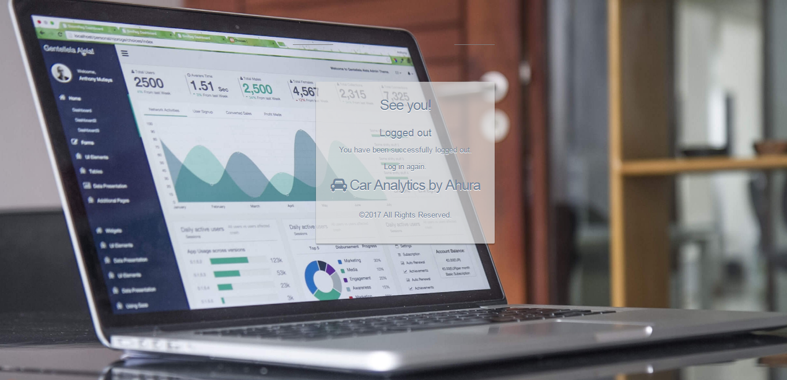
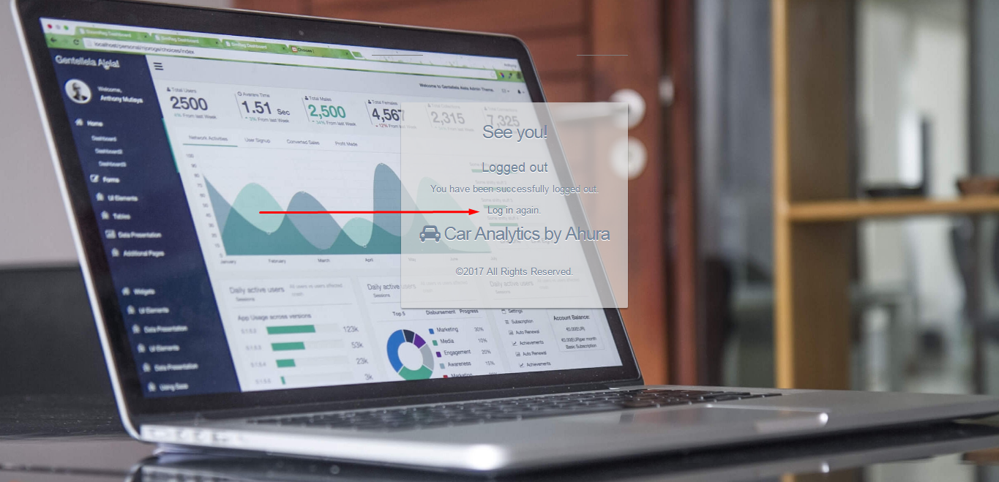

# Proyecto Final Desarrollo Web
## Car Analytics
### Automotive Business Intelligence  
_Proyecto realizado por Paolo Caviedes Saavedra_   	 
Usuario Admin : Admin | administrator 

Tener información precisa y confiable en la que basar las decisiones es clave para cualquier negocio es por esto que diseñamos "Car Analytics" para entregar esta informacionde diferentes maneras.  

Car Analytics le ayudará a través de todo el proceso, desde el análisis de un vehiculo pre-compra a la previsión de crecimiento o decrecimiento de las ventas de vehículos nuevos y usados.  

Car Analytics le permite optimizar el proceso de compra de su vehículo permitiéndole evaluar los factores clave del mercado y proporcionándole recomendaciones sobre cómo maximizar su ganancia.  

## Stack de Tecnologías  
Python  
Django  
SQLite  
HTML  

Django==1.11.1  
argparse==1.2.1  
distribute==0.6.24  
django-bootstrap-form==3.2.1  
django-login==1.0  
pytz==2017.2  
wsgiref==0.1.2  

## Base de Datos
Modelo escogido: Estrella  
Tabla de hechos: Vehiculo  
Para representar los requerimientos del negocio, se realizo el diseño de la base de datos segun la siguiente descripcion:  

## Cargar el Proyecto ##

### 1. Clone the repository:

    git clone https://github.com/paolocaviedes/ProyectoFinalWebDevelopment.git

### 2. Create a migration:

    python manage.py makemigrations main

### 3. Run migrations:

    python manage.py migrate main

### 3. Create a user (optional):

    python manage.py createsuperuser

### 4. Run the server:

    python manage.py runserver 

### 5. And open 127.0.0.1:8000/login in your web browser.

### 6. Pruebe el Proyecto.
Para ingresar, rellene el formulario inicial con las credenciales de Administrador (Admin | administrator) respetando minúsculas y mayúsculas.  
   

El proyecto cuenta con la programacion realizada para agregar/editar y eliminar usuarios, en el dashboard vaya a la seccion user management para desplegar dos opciones, nuevo usuario o editar usuario.      
  

  
Al seleccionar nuevo usuario, el sistema desplegará el formulario para agregar un usuario a la plataforma.  

  
Al seleccionar editar usuario, usted podrá ver todos los usuarios que existen en la plataforma, para editar un usuario basta con presionar el  primer nombre, en caso que desee eliminar un usuario, presione el boton eliminar.    

Para cerrar sesión vaya a la esquina superior derecha, presione User Name y luego Salir. El sistema lo redireccionará a la salida. 

Para Volver al Inicio, presione Log In

### Notas Finales

La fundamentación del proyecto es lograr realizar analisis de la información recolectada realizando Web Scrapping a reconocidas paginas de ventas de vehiculos para proveer tanto a personas como automotoras conocer información estadística sobre el mercado automotriz. Se crearon las vistas del proyecto las cuales puede revisar en el codigo fuente a que estas no han sido agregadas aun a las views. Además se identificaron 4 tipos de usuarios que no fueron implementados por tiempo de desarrollo, sin embargo, serán implementados en el corto plazo. estos usuarios son:  
Admin(superuser)  
Administrador de automotora (agrega trabajadores)  
trabajador de automotora (ve estadisticas en detalle y exporta reportes)  
Visita (ve estadisticas generales) 

