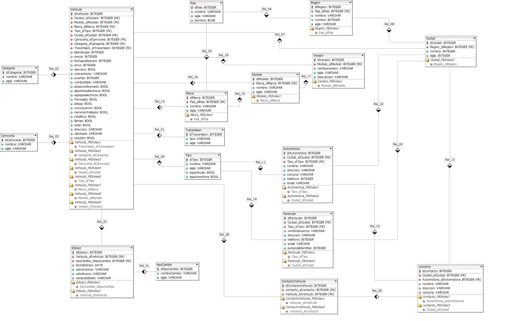

# Proyecto Final Desarrollo Web
## Car Analytics
### Automotive Business Intelligence  
_Proyecto realizado por Felipe Gajardo Osorio y Paolo Caviedes Saavedra_  

Tener información precisa y confiable en la que basar las decisiones es clave para cualquier negocio es por esto que diseñamos "Car Analytics" para entregar esta informacionde diferentes maneras.  

Car Analytics le ayudará a través de todo el proceso, desde el análisis de un vehiculo pre-compra a la previsión de crecimiento o decrecimiento de las ventas de vehículos nuevos y usados.  

Car Analytics le permite optimizar el proceso de compra de su vehículo permitiéndole evaluar los factores clave del mercado y proporcionándole recomendaciones sobre cómo maximizar su ganancia.  

## Stack de Tecnologías  
Python  
Django  
SQLite
HTML  

## Base de Datos
Modelo escogido: Estrella  
Tabla de hechos: Vehiculo  
Para representar los requerimientos del negocio, se realizo el diseño de la base de datos segun la siguiente descripcion:  

[Car Analytics Database Model](https://github.com/paolocaviedes/ProyectoFinalWebDevelopment/blob/master/ModelDatabase_CarAnalytics.txt "Modelo Base de Datos")

